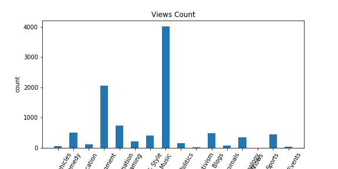
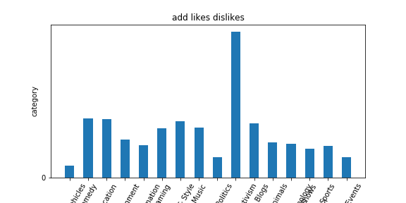
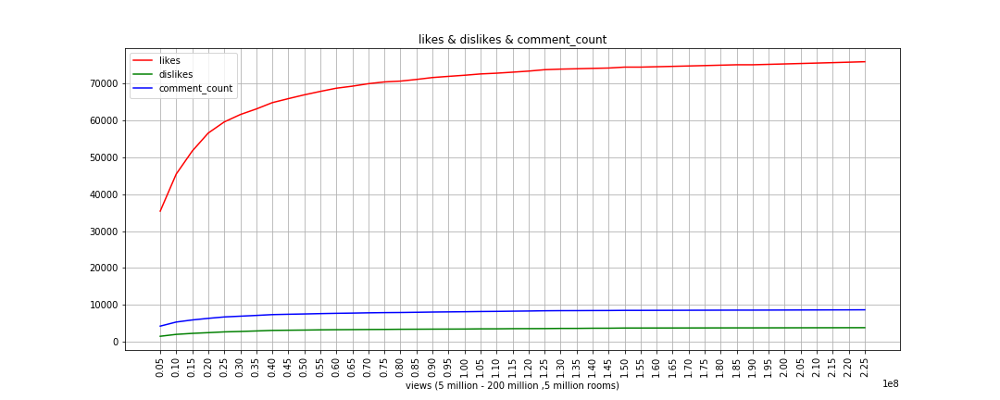
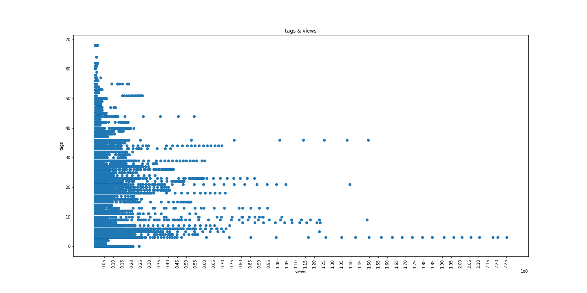
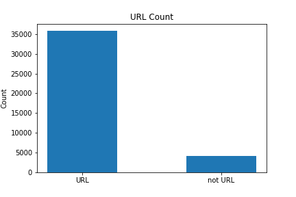
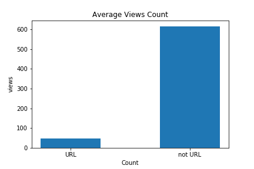
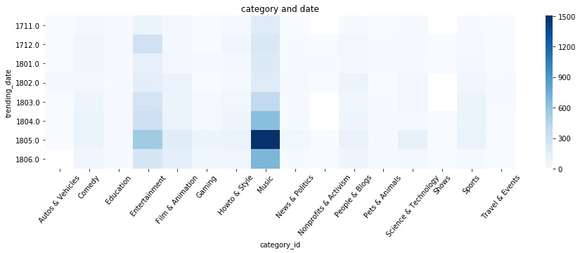

youtube推薦系統分析
====================
#### 介紹
在YouTube眼裡毫無內容的影片 = 「最佳」！？
有創意、有才華，製作出好的原創內容，卻沒有人看！？

也許不是創作者的問題，哪尼！？
在這創作之海中觀眾怎麼看得見你呢？
為脫穎而出，創作者需要一定程度的曝光！

透過對YouTube的推薦系統分析，針對影片優化成YouTube偏好的樣式有助於增加影片的人氣！

#### 資料集來源
- kaggle：Trending YouTube Video Statistics
- Link：https://www.kaggle.com/datasnaek/youtube-new
- 以「US」探討對象

#### 資料集欄位
|   |名稱   |描述   |
| :------------: | ------------ | ------------ |
|1 |video id |視頻ID|
|2 |trending date|發燒日期|
|3 |title |視訊名稱|
|4 |channel title|頻道名稱|
|5 |category id|類別ID|
|6 |pulish time|上傳日期|
|7 |tags|標籤|
|8 |views|觀看次數|
|9 |likes|喜歡|
|10|dislikes|不喜歡|
|11|comment count|評論數|
|12|thumbnail link|縮略圖鏈接|
|13|comments disabled|評論已禁用(TRUE/FLSE)|
|14|ratings disabled|評級(TRUE/FLSE)|
|15|video error or removed|視頻錯誤或已刪除(TRUE/FLSE)|
|16|description|描述

#### 問題定義
1. 各類別影片 - 觀看次數 & 喜歡 & 不喜歡 『有正關係??』
2. 各影片觀看次數區間 - 喜歡 & 不喜歡 & 留言數 『有正關係??』
3. 所有影片 - 標籤數 & 觀看次數 『有正關係??』
4. 影片下方詳細文字中有否YouTube的連結 & 觀看次數 『有正關係??』
5. 發燒影片中時間區間內是有特定幾種影片種類的！

#### 分析
##### 1. 各類別影片 - 觀看次數 & 喜歡 & 不喜歡 『有正關係??』
 
探討各類型影片之觀看次數和觀眾觸及率的關係
由右邊的圖以看出來，音樂類型的影片擁有最高觀看次數，
再來是娛樂，最後是喜劇類型的影片，
在這三者中，又以音樂類型最為突出，足足高出娛樂類兩倍，
我們推測，音樂之所以會有這麼高的觀看次數是因為大部分的觀眾會重複播放ＭＶ，
導致觀看次數異常高。
而左邊的圖顯示顯示各類型的按讚與倒讚總數，
我們可以直接發現，原本觀看次數高的影片，在觀眾的互動上並沒有和觀看次數成正比，
活動類型反而是最高，那是因為”活動“、“社會運動”本身就是需要人來參與，
所以才會有很高的參與率。除此之外，發現喜劇與娛樂類型反而比音樂還高，
這應證了觀眾主要是重複播放ＭＶ聽歌，而非“觀看”影片。
> 在這些數據之中，推薦創作者往喜劇、娛樂等方向創作有幫助曝光

##### 2. 各影片觀看次數區間 - 喜歡 & 不喜歡 & 留言數 『有正關係??』

此曲線圖顯現出按讚、倒讚與留言數與觀看次數之關係圖，
可以看出，隨著觀眾互動數越高，觀看次數越高，
所以不論正面或是負面的互動，都對影片曝光有幫助！
但是當觀看次數高到一定次數時，觀眾互動數並沒有像之前線性成長，
我們可以推測高觀看次數可能來自重複觀看，所以互動數沒有繼續成長。
> 在這些數據之中，我們找不到一部擁有高觀眾觸及率，但觀看次數低的！
> 由此可知youtube的推薦系統偏好和觀眾互動多的影片。
> 創作者應誘導觀眾和影片互動，讚、留言評論，不論正反面，都對影片曝光有幫助！

##### 3. 所有影片 - 標籤數 & 觀看次數 『有正關係??』

影片的觀看次數是否和影片的標籤數有關係？
目前可由數據圖看出來兩者沒有直接關係，所以越多標籤不代表有越高的機會曝光，
就像我們分析影片，youtube的曝光AI也會分析影片，找出適合曝光、製造收益的影片，
也許大量的標籤會導致誤導AI或這是被忽略，也許針對影片選擇適當的標籤是比較有幫助的。
> 標籤多不如標籤好，創作者可以觀察其他風格似又成功的影片如何標籤，增加觀眾搜尋到的機會

##### 4. 影片下方詳細文字中有否YouTube的連結 & 觀看次數 『有正關係??』
 
影片下方詳細文字中有否YouTube的連結，有得話是否和影片觀看次數有正關係??
結果發現，大部分的影片都有含有連結，但在有連結與沒有連結的平均觀看次數比較下，
沒有連結的影片卻有非常高的平均值！
所以推測youtube希望觀眾留在youtube中，所對外連離開原站的影片被曝光的機會就低。
> 建議創作者在影片下方詳細文字中盡量不要附上對外連結，反而可以增加對youtube的連結，
> 讓觀眾持續留在youtube，是youtube推薦系統偏好的！

##### 5. 發燒影片中時間區間內是有特定幾種影片種類的！

發燒影片中時間區間內是有特定幾種影片種類的！
根據圖示，容易上熱門的影片是音樂、娛樂、喜劇，和參與較高的類型(活動、運動)，
但是可以發現從3月開始到5月，有大量音樂、娛樂的影片上熱門，
這和當地活動與較知名樂手出新歌有關係！
在美國的三到五月有大量的大型音樂活動(Air+Style Festival、SXSW、Ultra、In Bloom)
且在接連幾個月知名度較高歌手出新歌有關
(Ariana Grande、BTS、Christina Aguilera、CelineDion、Taylor Swift)
> 觀察時下流行趨勢，選擇適當的時機發表創作，讓youtube更有機會推薦你！

#### 結果
1. 推薦創作者往**喜劇、娛樂**等方向創作有幫助曝光。
2. YouTube的推薦系統偏好**和觀眾互動**多的影片。
3. 創作者應誘導觀眾和影片互動，讚、留言評論，不論正反面，都對影片曝光有幫助！
4. 標籤多不如**標籤好**，增加觀眾搜尋到的機會
5. 詳細文字中盡量**不要附上對外連結**
6. 觀察**時下**流行趨勢，選擇**適當**的時機發表創作，讓YouTube更有機會推薦你！
